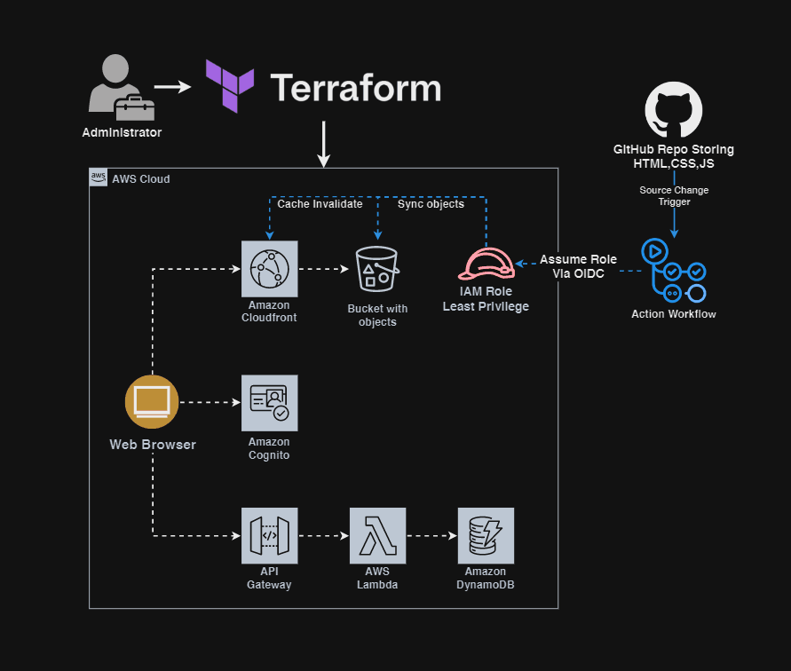

# AWS Vue Serverless Application - Infrastructure
This is an educational project done with accordance to public Webapp Serverless AWS Workshop.

## Table of Contents
- [AWS Vue Serverless Application - Infrastructure](#aws-vue-serverless-application---infrastructure)
  - [Table of Contents](#table-of-contents)
  - [Architecture](#architecture)
  - [Reproduction Guide](#reproduction-guide)
    - [Prerequisites](#prerequisites)
    - [Configure AWS Credentials](#configure-aws-credentials)
    - [State Backend Setup](#state-backend-setup)
    - [Local Deployment](#local-deployment)
    - [CI/CD Setup](#cicd-setup)

## Architecture
This project implements a serverless architecture on AWS for hosting a static web application.



Core components:
- CloudFront for content delivery
- S3 for static website hosting
- API Gateway for REST endpoints
- Lambda for serverless compute
- DynamoDB for data persistence
- GitHub Actions for Continuous Deployment
- OIDC provider for authorizing GitHub Runner

Estimated monthly costs for original development environment:
- CloudFront: ~$0.85 (50GB transfer)
- S3: ~$0.023 (1GB storage)
- API Gateway: ~$1.00 (100K requests)
- Lambda: ~$0.20 (100K invocations)
- DynamoDB: Free tier eligible
- Cognito: Free tier eligible (50K MAU)
- CodeCommit: ~$1.00/active user/month
- Amplify: ~$0.01/build minute (~$2 for 200 build minutes)
- **Total**: ~$5.08/month

Estimated monthly costs for cut-down development environment:
- CloudFront: ~$0.85 (50GB transfer)
- S3: ~$0.023 (1GB storage)
- API Gateway: ~$1.00 (100K requests)
- Lambda: ~$0.20 (100K invocations)
- DynamoDB: Free tier eligible
- Cognito: Free tier eligible (50K MAU)
- GitHub: Free (public repositories)
- **Total**: ~$2.07/month

All services are configured to minimize costs and utilize AWS Free Tier where possible. GitHubs's free tier for public repositories includes Actions minutes and artifact storage.

## Reproduction Guide

### Prerequisites
- AWS CLI configured
- Terraform >= 1.0
- GitHub repository access

### Configure AWS Credentials
[Checkout terraform docs](https://registry.terraform.io/providers/hashicorp/aws/latest/docs)

### State Backend Setup
```bash
# clone/fork the repo
git clone https://github.com/Asserzayed/aws-vue-serverless-app

# create your state bucket, take note of its id/name
cd terraform/modules/state-bucket
terraform init
terraform apply

```

### Local Deployment

1. Configure your backend
```bash
cd aws-vue-serverless-app/terraform
# edit your backend.tf with your bucket name (variables aren't allowed in backend), or
terraform init backend-config="bucket=<your-tf-bucket-name>" -backend-config="key=terraform/terraform.tfstate" -backend-config="region=<your-region>" -backend-config="encrypt=true" -backend-config="use_lockfile=true"

```

2. Update variables:
```hcl
# variables.tf
organization_repo      = "your-org/your-repo"
tfstate_bucket_name    = "your-tf-bucket-name"
```

3. Deploy infrastructure:
```bash
terraform plan
terraform apply -auto-approve
```

4. Record outputs:
```bash
# save github-iam-role-arn for GitHub token role assumption authorization
terraform output
```

### CI/CD Setup
Option 1 - GitHub Actions:
1. Fork the repo

2. Add repository secrets:
```bash
AWS_ROLE_ARN
TF_STATE_BUCKET_ID # your state bucket id
MY_AWS_REGION
```
3. Trigger the repo manually or by static file change (html,js,image)

Option 2 - Local sync:
```bash
# Work dir at repo root
cd aws-vue-serverless-app
# Sync built files to S3
aws s3 sync . s3://<static-bucket-id> --exclude 
".git/*" --exclude "terraform/*" --exclude "*.DS_Store"
```
